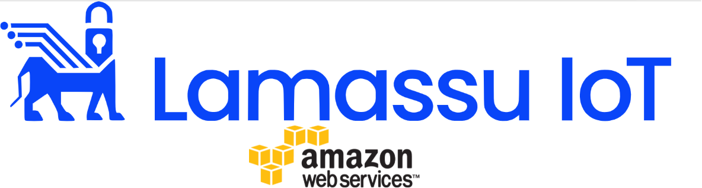

##  License

# Lamassu AWS Integration

##### Table of Contents  
* [Introduction](#Introduction)
* [Documentation](#Documentation)
* [Authors](#Authors)
* [License](#License)  

## Introduction

This repo gathers all the code and information that has been used to develop the integration between Lamassu IoT and Amazon Web Services.

## Documentation

* ***AWS Connector***: [AWS Connector Documentation](docs/aws_connector/aws_connector.md)
* ***Lamassu CDK***: [AWS CDK Documentation](docs/cdk/cdk.md)

Additional documentation

* ***Cloud events***: [Cloud Events Documentation](docs/cloud_events/cloud_events.md)
* ***Just in time provisioning***: [JITP Documentation](docs/jitp/jitp.md)